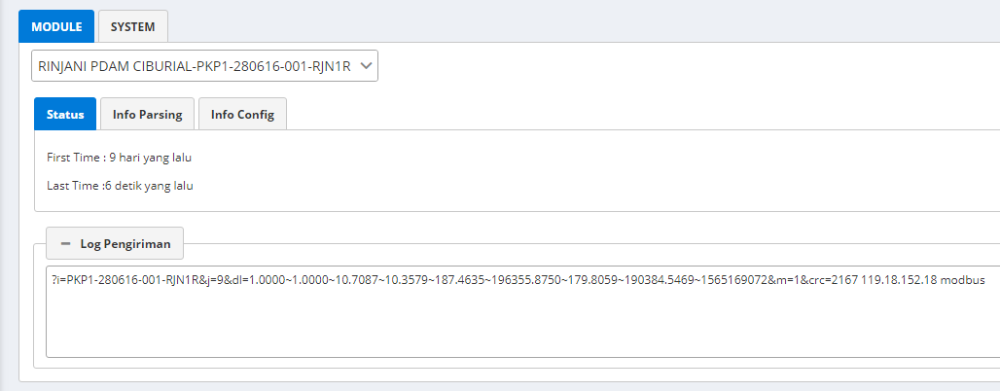

# 2. Dashboard

Dashboard merupakan halaman antarmuka yang menampilkan data dari setiap modul secara _realtime._

### Petunjuk Penggunaan:

Untuk memulai, pilihlah modul yang ingin di lihat dari _dropdown_ seperti di gambar.

Untuk melihat data parsing serta data Konfigurasi modul, tekan _tab Info Parsing_ atau _tab info Config_.

Untuk melihat data sistem tekan _Tab System_.

